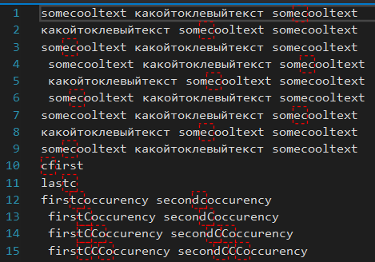

# FixRussianC

A Visual Studio Extension to highlight a russian letter С in an English word and the English letter C in a Russian word.

## Download 

Here you can download this [vsix vor Visual Studio 2019](https://marketplace.visualstudio.com/items?itemName=lsoft.FixRussianC) or [vsix vor Visual Studio 2022](https://marketplace.visualstudio.com/items?itemName=lsoft.FixRussianC64).